# [데이터 분석] 01. Numpy

## **특강** 쓰레드와 멀티프로세스(첨부파일 p00)

### 🔑 주요 학습 내용

1. **배열 기초 속성**: `ndim`(축 개수), `shape`(차원 정보), `size`(원소 총 개수), `dtype`(자료형) 이해
2. **다차원 배열**: 1차원 → 2차원 배열 생성, 타입 변환, `flatten()` 처리
3. **난수 생성**: `randint()`, `rand()`, `randn()` 등 numpy random 함수군 활용

### 💡 실습 방향

배열의 `shape`와 `dtype`을 항상 먼저 확인하는 것을 권장.
NumPy는 Pandas의 기반이 되는 라이브러리이므로 배열 연산 개념을 확실히 잡는 것이 핵심.

#Numpy #데이터분석 #배열 #난수 생성 #Python

# [데이터 분석] 02. pandas 기본

### 🔑 주요 학습 내용

1. **시각화 기초 (Matplotlib)**: 데이터를 시각적으로 표현하는 차트 출력 기초
2. **Netflix 데이터 분석**: Alltime 데이터를 활용한 데이터 적재 → 정제 → EDA 전 과정 실습
3. **Pandas 핵심 제어**: `loc` / `iloc` 기반 데이터 조회, 조건 필터링(Boolean Indexing), 결측치(NaN) 처리
4. **시계열 데이터 처리**: `datetime` 타입 변환 및 날짜 기반 데이터 핸들링
5. **실전 API 연동**: 주식 데이터(`FinanceDataReader`) 및 미국 FDA 공공 API(`openFDA`) 연동

### 💡 실습 방향

막히는 부분이 있다면 데이터의 구조와 타입(`shape`, `dtypes`, `info()`)을 우선 확인하는 것을 권장.
데이터 분석은 결국 데이터를 이해하는 과정이며, 첫 셀부터 순서대로 실행하며 흐름을 따라가는 것이 핵심.

---

> - `groupby`에서 `.reset_index()` 사용유무 차이

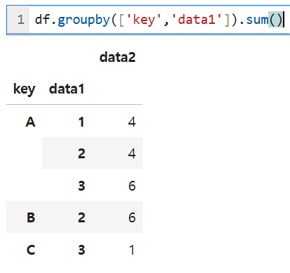

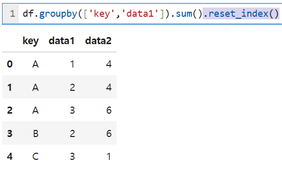

#pandas #데이터 분석 #Matplotlib #시계열 데이터 #API 연동

# [데이터 분석] 03. Pandas 실습심화

# 📊 [실습 가이드] Pandas & 데이터 분석 실전 다지기 (py03_pandas실습)

### 🔑 주요 학습 내용

1. **시각화 기초 (Matplotlib)**: 데이터를 시각적으로 표현하는 차트 출력 기초
2. **Netflix 데이터 분석**: Alltime 데이터를 활용한 데이터 적재 → 정제 → EDA 전 과정 실습
3. **Pandas 핵심 제어**: `loc` / `iloc` 기반 데이터 조회, 조건 필터링(Boolean Indexing), 결측치(NaN) 처리
4. **시계열 데이터 처리**: `datetime` 타입 변환 및 날짜 기반 데이터 핸들링
5. **실전 API 연동**: 주식 데이터(`FinanceDataReader`) 및 미국 FDA 공공 API(`openFDA`) 연동

### 💡 실습 방향

막히는 부분이 있다면 데이터의 구조와 타입(`shape`, `dtypes`, `info()`)을 우선 확인하는 것을 권장
데이터 분석은 결국 데이터를 이해하는 과정이며, 첫 셀부터 순서대로 실행하며 흐름을 따라가는 것이 핵심

---

> - (실습) 넷플릭스 tsv 데이터
>   https://www.netflix.com/tudum/top10
>   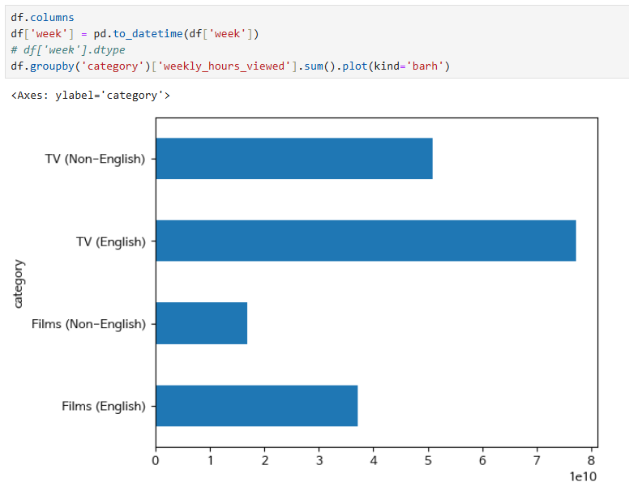

#Pandas #데이터 분석 #실습 #시계열 데이터 #시각화

# [데이터 분석] 04. Matplotlib

> **📓 ipynb 분석 요약** (py04_matplotlib(완).ipynb)

## 주제/목적

다양한 종류의 그래프(선, 막대, 산점도, 파이, 히트맵 등)를 `matplotlib` 라이브러리를 사용하여 시각화하는 방법을 학습하고, QR 코드 생성 및 인식 기능을 구현합니다.

## 주요 흐름

- `matplotlib.pyplot`을 임포트하여 기본적인 선 그래프를 그립니다.
- 데이터의 종류에 따라 다양한 스타일(색상, 마커, 선 종류)을 적용합니다.
- 그래프에 레이블, 범례, 축 스케일(로그, 대칭 로그)을 설정합니다.
- 그래프 영역 채우기, 막대 그래프, 산점도, 파이 차트, 히트맵 등 다양한 그래프 유형을 생성합니다.
- `subplot`을 사용하여 여러 그래프를 한 화면에 표시합니다.
- `qrcode` 라이브러리를 사용하여 QR 코드를 생성하고, `Pillow`와 `OpenCV`를 활용하여 QR 코드를 이미지로 저장하고 인식하는 기능을 구현합니다.

## 사용 기술

- **Python**: 프로그래밍 언어
- **Matplotlib**: 데이터 시각화 라이브러리 (`pyplot` 모듈)
- **NumPy**: 수치 연산 및 배열 처리 라이브러리
- **Qrcode**: QR 코드 생성 라이브러리
- **Pillow**: 이미지 처리 라이브러리 (이미지 저장)
- **OpenCV (cv2)**: 컴퓨터 비전 라이브러리 (QR 코드 인식)

## 결과/결론

다양한 형태와 옵션을 가진 그래프를 효과적으로 시각화하는 방법을 습득할 수 있습니다. 또한, 텍스트 데이터를 QR 코드로 변환하고 이미지에서 QR 코드를 인식하는 기능을 구현할 수 있습니다.

---

#Matplotlib #데이터 시각화 #Python #QR 코드

# [데이터 분석] 05. Matplotlib(Seaborn)

### Seaborn 주요 컬러 팔레트 분류

| 분류                     | 용도                           | 대표적인 팔레트 이름                                                                                |
| :----------------------- | :----------------------------- | :-------------------------------------------------------------------------------------------------- |
| **정성적 (Qualitative)** | 순서가 없는 범주형 데이터 구분 | `deep`, `muted`, `pastel`, `bright`, `dark`, `colorblind`, `Set1`, `Set2`, `Set3`, `tab10`, `tab20` |
| **순차적 (Sequential)**  | 값의 크기 변화(연속형 데이터)  | `Blues`, `Greens`, `Reds`, `viridis`, `magma`, `inferno`, `plasma`, `rocket`, `mako`                |
| **발산형 (Diverging)**   | 중간값을 기준으로 양극단 강조  | `vlag`, `icefire`, `coolwarm`, `RdBu`, `BrBG`, `PuOr`, `RdGy`, `Spectral`                           |

---

### 팔레트 선택 가이드

- **정성적 팔레트**: 데이터 항목 간의 차이를 시각적으로 뚜렷하게 구분하고 싶을 때 사용합니다. (예: 막대 그래프의 카테고리별 색상)
- **순차적 팔레트**: 값이 커짐에 따라 색상이 진해지므로, 수치의 밀도나 범위를 표현할 때 효과적입니다. (예: 히트맵, 밀도 그래프)
- **발산형 팔레트**: 0 또는 중앙값을 기준으로 음수와 양수를 명확히 구분해야 할 때 사용합니다. (예: 상관관계 분석, 변화율)

#Matplotlib #Seaborn #데이터 시각화 #컬러 팔레트

# [데이터 수집] 06. 데이터크롤링

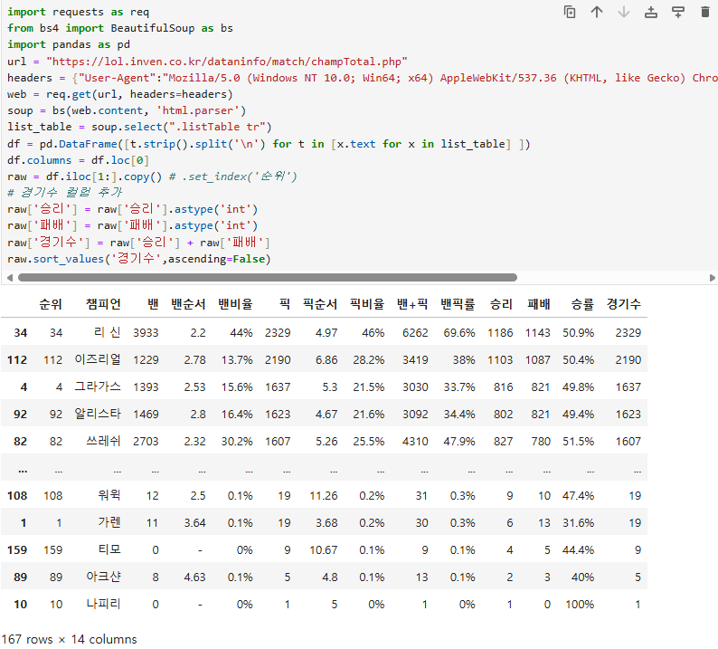

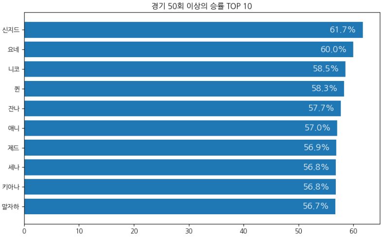

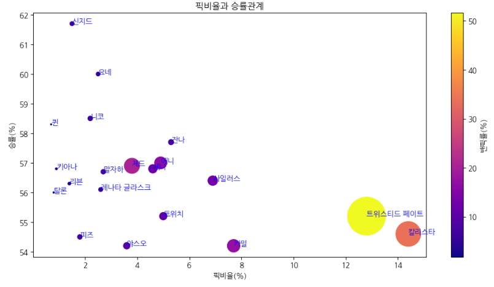

[[데이터 수집] 10. 데이터 크롤링2](#데이터수집10.데이터크롤링2) #데이터크롤링 #게임승률통계

# [데이터 분석] 07. 청소년 정신건강

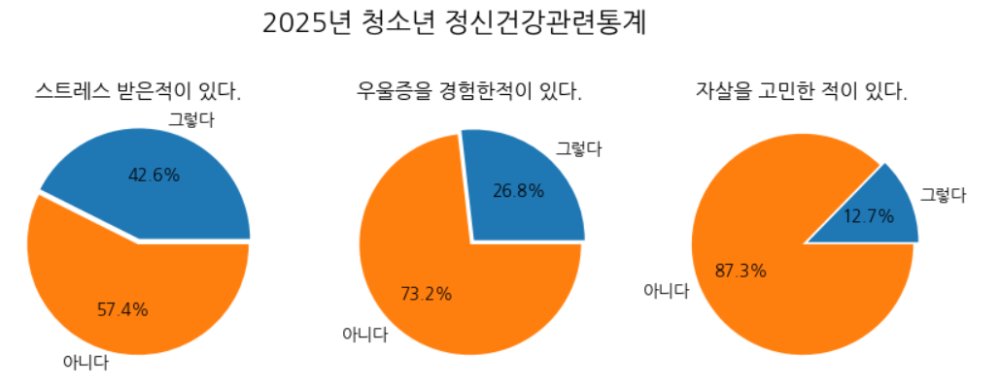

#청소년 정신건강 #데이터분석 #정신건강 #pandas

# [데이터 분석] 08. 인천공항 이용자수 분석 및 예측

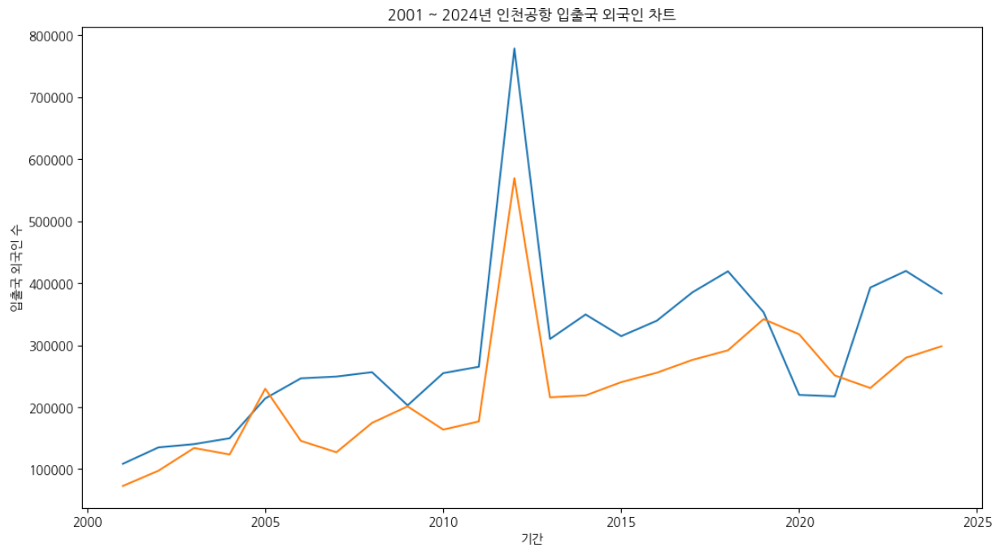

1. https://kosis.kr/search/search.do 접속
2. 출입국 항구/내외국인/성별 국제이동(연간) 검색
3. 항목(우측사이드): 입국자,출국자,인천공항,내외국인,남여,기간선택
4. 피봇테이블 설정
   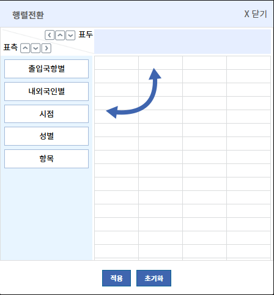

#데이터분석 #인천공항 #이용자수예측 #KOSIS #통계

# [데이터 분석] 09. 워드데이터 분석

> !pip install wordcloud
> !pip install konlpy

- 도커에서

```sh
docker exec -it --user root jupy bash
apt-get update && apt-get install -y default-jdk
```


#워드클라우드 #데이터분석 #Konlpy #Python #Docker

# [데이터 수집] 10. 데이터 크롤링2

```py
import requests as req
from bs4 import BeautifulSoup as bs
import pandas as pd
import re # 정규표현식
url = 'https://www.weather.go.kr/w/weather/forecast/short-term.do?stnId=159'
web = req.get(url)
soup = bs(web.content ,'html.parser')
summ = soup.select('.summary')
for s in summ:
    result= re.sub(r"\s+"," ",s.text)
    print(result.replace("○","\n○"))
```

#데이터크롤링 #파이썬 #웹스크래핑 #BeautifulSoup #requests

# [데이터 분석] 11. 교통사고유형별발생분석

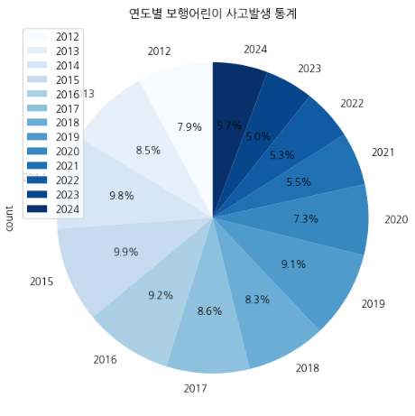

#교통사고 #데이터분석 #사고유형 #발생분석

# [데이터 분석] 12. 지하철 이용자 통계분석

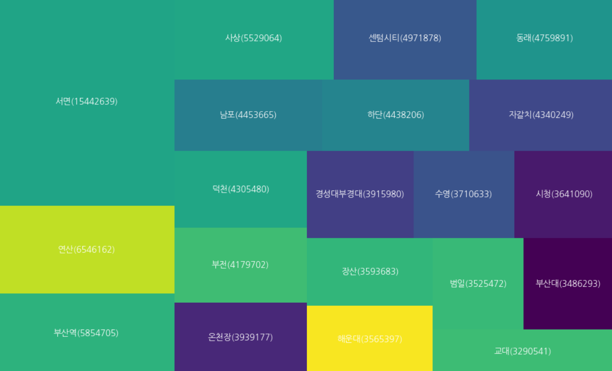

#데이터분석 #지하철 #통계분석

# [데이터 분석] 13. 온라인/모바일 쇼핑몰 매출 분석

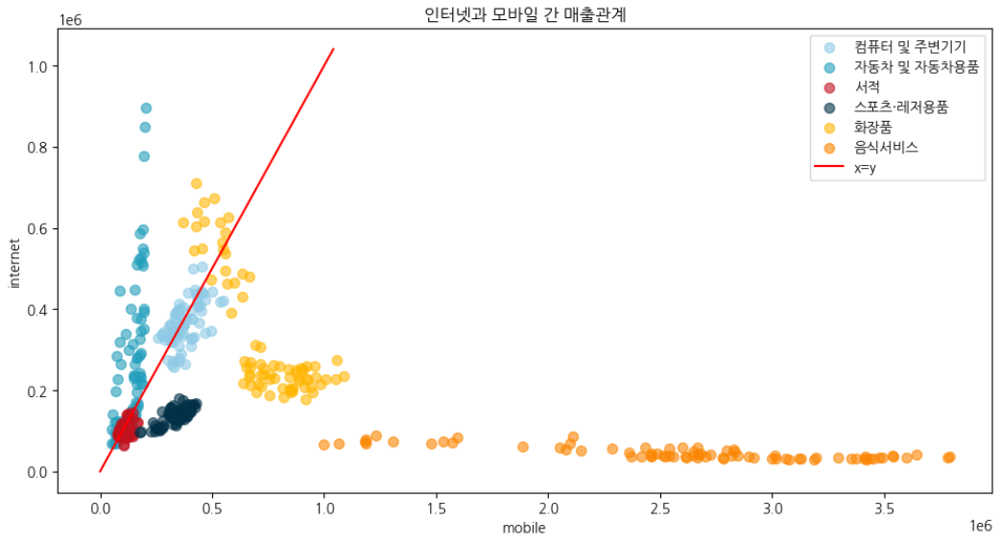

#데이터분석 #쇼핑몰 #온라인쇼핑 #모바일쇼핑

# [데이터 적재] 14. HDFS에서 데이터 가져와서 분석

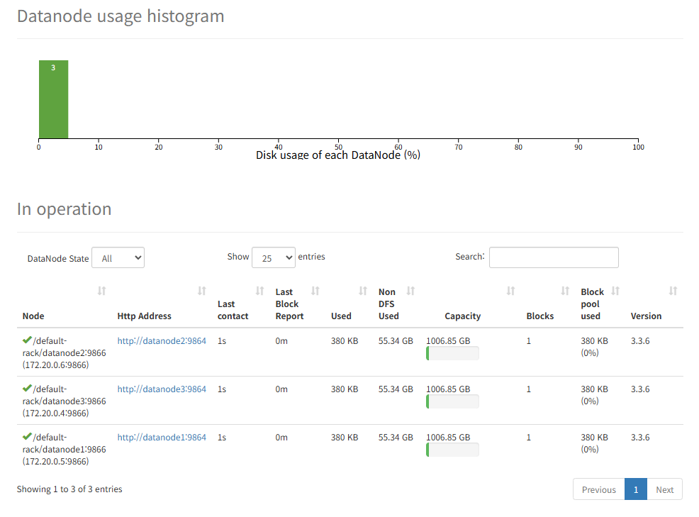

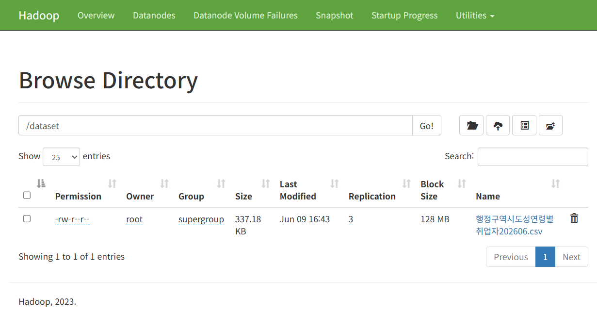

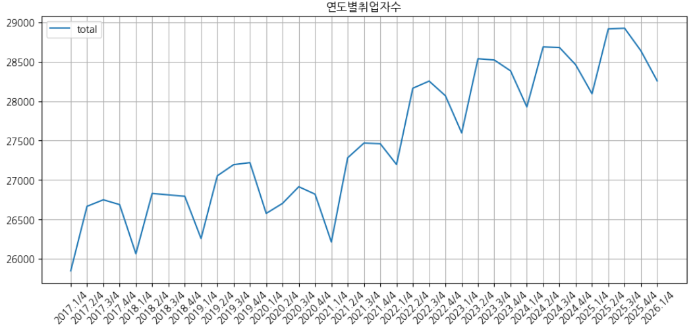

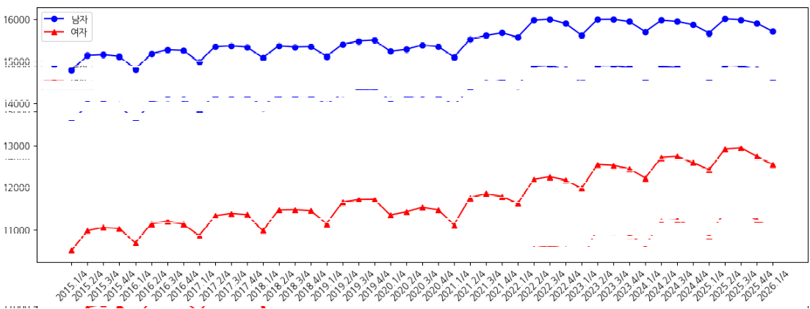

```py
from hdfs import InsecureClient
import pandas as pd

lient_hdfs = InsecureClient('http://namenode:9870',user='hadoop')
path = "/dataset/행정구역시도성연령별취업자202606.csv"

with client_hdfs.read(path, encoding='euc-kr') as reader:
    data = pd.read_csv(reader)

```

- ### 도커로 network 의 ip확인 및 컨테이너에 네트워크 부착방법

```sh
docker network --help
docker network ls
docker network inspect hadoop_hadoop-net
docker network connect hadoop_hadoop-net jupy2
```

#HDFS #데이터 적재 #Python #Docker #hadoop #하둡

# [데이터 적재] 15. HDFS 방범용 CCTV 데이터 분석

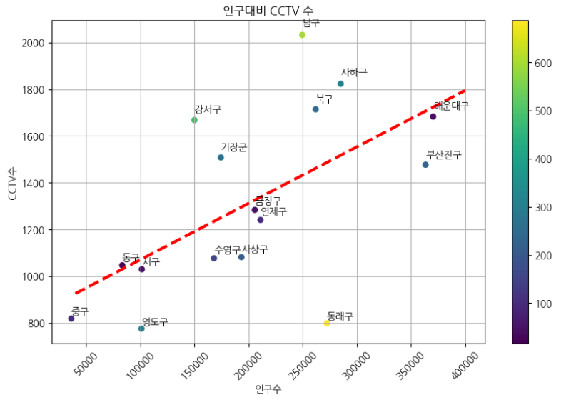

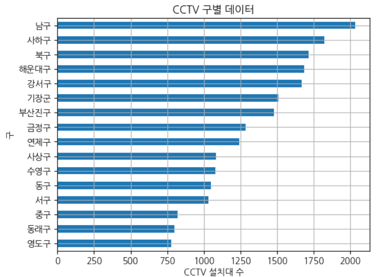

#HDFS #데이터분석 #CCTV #빅데이터

# [데이터 적재] 16. Python으로 HDFS CRUD 제어

> **📝 AI 요약**
>
> - Python의 `hdfs` 라이브러리를 사용하여 HDFS에 연결하고 CRUD 작업을 수행할 수 있습니다.
> - 예제 코드는 HDFS의 특정 경로에 있는 파일 목록을 안전하게 읽어오는 방법을 보여줍니다.
> - 이 라이브러리를 통해 파일 업로드, 다운로드, 삭제 등 다양한 HDFS 파일 관리 기능을 Python으로 구현할 수 있습니다.

HDFS(Hadoop Distributed File System)는 대규모 데이터셋을 저장하고 관리하기 위한 분산 파일 시스템입니다. Python을 사용하여 HDFS의 데이터를 안전하게 생성(Create), 읽기(Read), 갱신(Update), 삭제(Delete)하는 CRUD 작업을 수행할 수 있습니다. `hdfs` 라이브러리를 활용하면 간편하게 HDFS에 접근하고 제어할 수 있습니다.

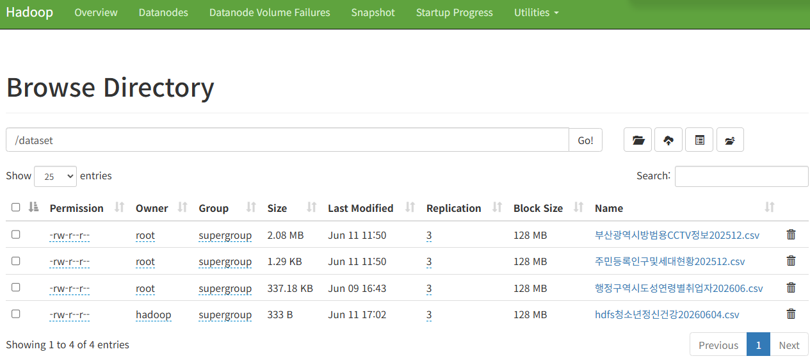

아래 예제 코드는 `hdfs` 라이브러리를 사용하여 HDFS에 안전하게 연결하고, 특정 경로에 있는 파일 목록을 읽어오는 방법을 보여줍니다.

```py
from hdfs import InsecureClient

# HDFS 클라이언트 설정
user = 'hadoop'
host = 'http://namenode:9870'
hdfs_path = '/dataset'

# InsecureClient를 사용하여 HDFS에 연결
# 인증 없이 비보안 모드로 연결됩니다.
hdfs = InsecureClient(host, user)

# 지정된 경로의 파일 및 디렉토리 목록 가져오기
file_list = hdfs.list(hdfs_path)

# 목록 출력
for item in file_list:
    print(item)
```

이 코드를 실행하면 `hdfs_path`에 지정된 HDFS 경로에 포함된 모든 파일과 디렉토리의 이름이 출력됩니다. 이는 HDFS의 기본적인 파일 목록 조회 기능을 Python으로 구현한 것입니다. 또한 `hdfs` 라이브러리는 파일 업로드, 다운로드, 삭제 등 다양한 CRUD 작업을 지원합니다.

#HDFS #Python #데이터 적재 #CRUD #파일 관리 #Ai_inhance

##### [AI 수정 내역]

###### Python으로(PY으로), 지정된 경로의 파일 및 디렉토리 목록 가져오기(경로내 목록 읽어오기), file_list = hdfs.list(hdfs_path)

###### 목록 출력

for item in file_list:
print(item)(show = hdfs.list(hdfs_path)
for s in show:
print(s))

# [데이터 분석] 17. HDFS에서 연도별 출생인구분석

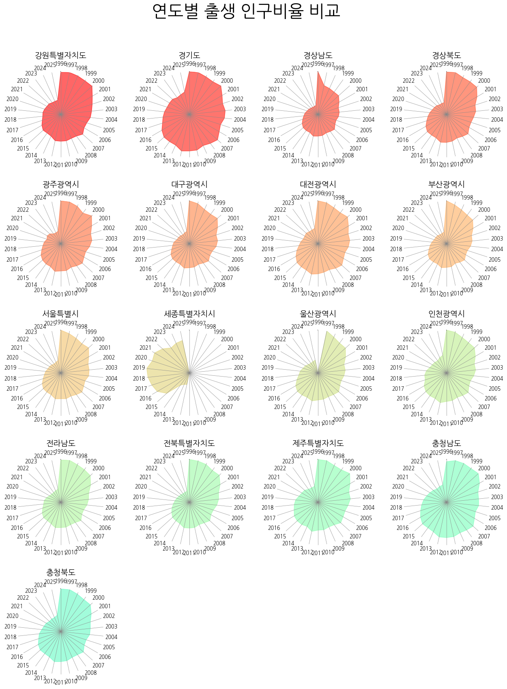

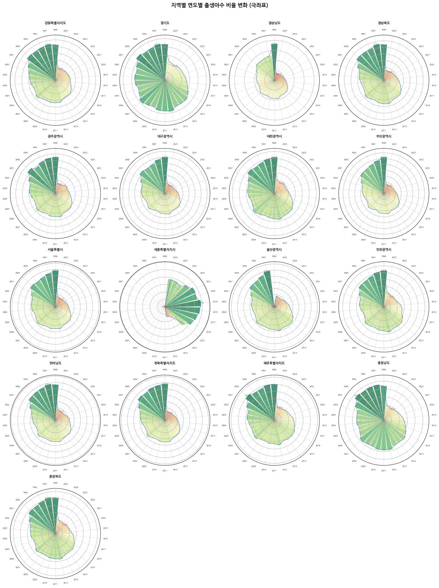

#데이터분석 #HDFS #출생인구분석 #빅데이터

# [데이터 분석] 18. HDFS에서 연도별 출생인구분석

- 행정안전부 주민등록 인구통계 https://jumin.mois.go.kr/

- 행정동별 연령별 인구현황

- 현재 6년간씩 조회가능. 2009~2014년, 2015~2020년, 2020~2025년 조회
- 검색 후 CSV 다운로드

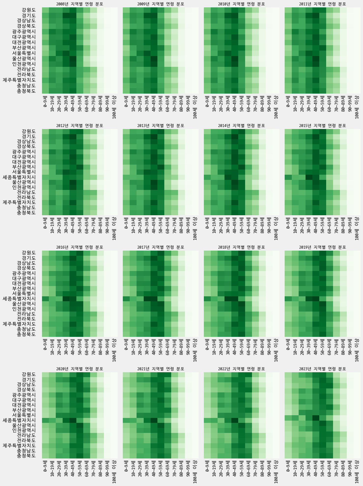

숙제내줌

#데이터분석 #HDFS #출생인구 #주민등록 #인구통계 #연도별분석

# [데이터 ETL] 19. 웹드라이버로 텐퍼센트커피 사이트 크롤링

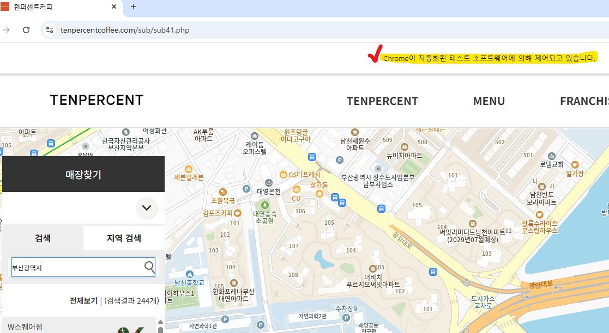

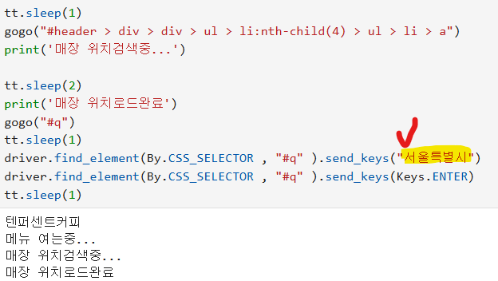

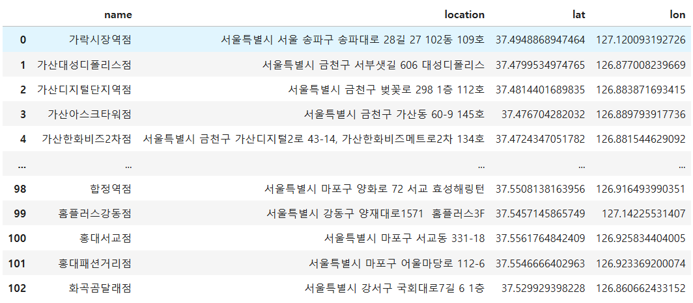

- hadoop 에 저장됨
  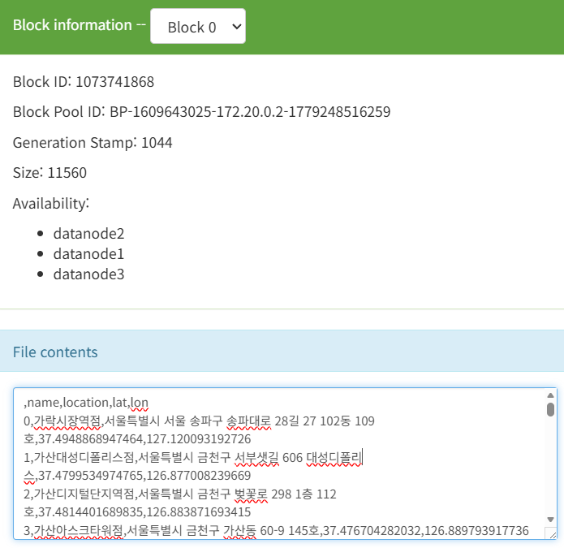

# [데이터 ETL] 20. 웹드라이버로 싼주유소 사이트 크롤링 파일저장.

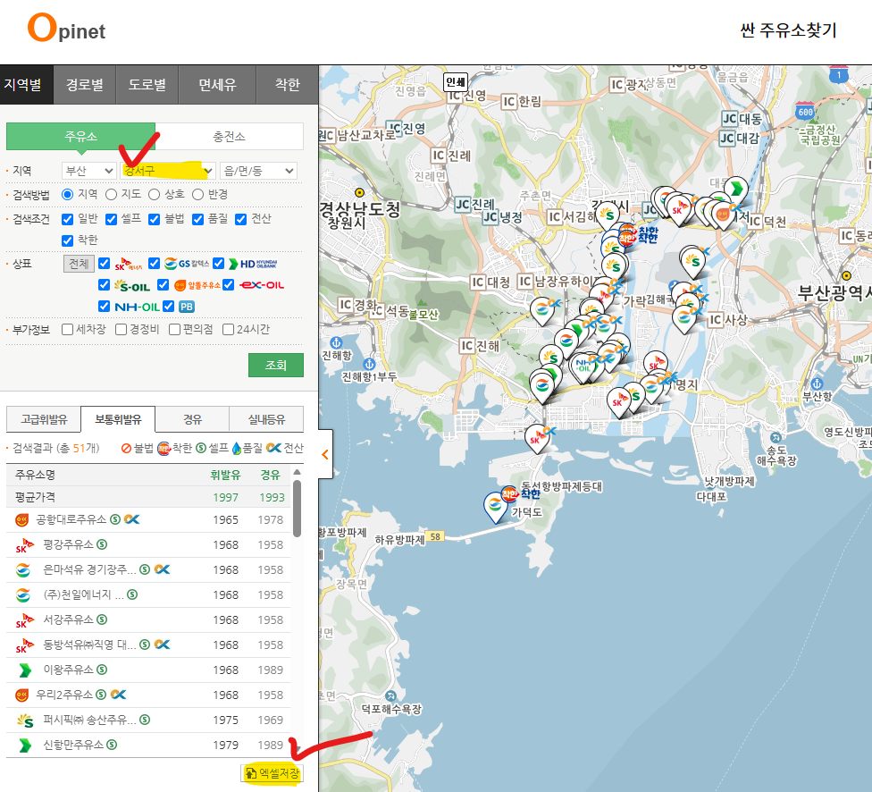
